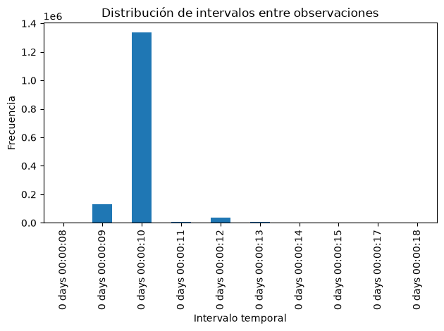

# Exploración del dataset MetroPT-3

**Trabajo Fin de Máster**

## Objetivo

Realizar un análisis exploratorio del dataset MetroPT-3 para comprender su estructura, calidad y características antes del diseño e implementación del pipeline de ingeniería de datos.


```python
import pandas as pd
from pathlib import Path

DATA_PATH = Path("../data/raw/MetroPT3(AirCompressor).csv")

print(DATA_PATH)
print(DATA_PATH.exists())
```

    ../data/raw/MetroPT3(AirCompressor).csv
    True


```python
df = pd.read_csv(DATA_PATH)

print(f"Número de filas: {df.shape[0]:,}")
print(f"Número de columnas: {df.shape[1]}")

df.head()
```

    Número de filas: 1,516,948
    Número de columnas: 17


<div>
<style scoped>
    .dataframe tbody tr th:only-of-type {
        vertical-align: middle;
    }

    .dataframe tbody tr th {
        vertical-align: top;
    }

    .dataframe thead th {
        text-align: right;
    }
</style>
<table border="1" class="dataframe">
  <thead>
    <tr style="text-align: right;">
      <th></th>
      <th>Unnamed: 0</th>
      <th>timestamp</th>
      <th>TP2</th>
      <th>TP3</th>
      <th>H1</th>
      <th>DV_pressure</th>
      <th>Reservoirs</th>
      <th>Oil_temperature</th>
      <th>Motor_current</th>
      <th>COMP</th>
      <th>DV_eletric</th>
      <th>Towers</th>
      <th>MPG</th>
      <th>LPS</th>
      <th>Pressure_switch</th>
      <th>Oil_level</th>
      <th>Caudal_impulses</th>
    </tr>
  </thead>
  <tbody>
    <tr>
      <th>0</th>
      <td>0</td>
      <td>2020-02-01 00:00:00</td>
      <td>-0.012</td>
      <td>9.358</td>
      <td>9.340</td>
      <td>-0.024</td>
      <td>9.358</td>
      <td>53.600</td>
      <td>0.0400</td>
      <td>1.0</td>
      <td>0.0</td>
      <td>1.0</td>
      <td>1.0</td>
      <td>0.0</td>
      <td>1.0</td>
      <td>1.0</td>
      <td>1.0</td>
    </tr>
    <tr>
      <th>1</th>
      <td>10</td>
      <td>2020-02-01 00:00:10</td>
      <td>-0.014</td>
      <td>9.348</td>
      <td>9.332</td>
      <td>-0.022</td>
      <td>9.348</td>
      <td>53.675</td>
      <td>0.0400</td>
      <td>1.0</td>
      <td>0.0</td>
      <td>1.0</td>
      <td>1.0</td>
      <td>0.0</td>
      <td>1.0</td>
      <td>1.0</td>
      <td>1.0</td>
    </tr>
    <tr>
      <th>2</th>
      <td>20</td>
      <td>2020-02-01 00:00:19</td>
      <td>-0.012</td>
      <td>9.338</td>
      <td>9.322</td>
      <td>-0.022</td>
      <td>9.338</td>
      <td>53.600</td>
      <td>0.0425</td>
      <td>1.0</td>
      <td>0.0</td>
      <td>1.0</td>
      <td>1.0</td>
      <td>0.0</td>
      <td>1.0</td>
      <td>1.0</td>
      <td>1.0</td>
    </tr>
    <tr>
      <th>3</th>
      <td>30</td>
      <td>2020-02-01 00:00:29</td>
      <td>-0.012</td>
      <td>9.328</td>
      <td>9.312</td>
      <td>-0.022</td>
      <td>9.328</td>
      <td>53.425</td>
      <td>0.0400</td>
      <td>1.0</td>
      <td>0.0</td>
      <td>1.0</td>
      <td>1.0</td>
      <td>0.0</td>
      <td>1.0</td>
      <td>1.0</td>
      <td>1.0</td>
    </tr>
    <tr>
      <th>4</th>
      <td>40</td>
      <td>2020-02-01 00:00:39</td>
      <td>-0.012</td>
      <td>9.318</td>
      <td>9.302</td>
      <td>-0.022</td>
      <td>9.318</td>
      <td>53.475</td>
      <td>0.0400</td>
      <td>1.0</td>
      <td>0.0</td>
      <td>1.0</td>
      <td>1.0</td>
      <td>0.0</td>
      <td>1.0</td>
      <td>1.0</td>
      <td>1.0</td>
    </tr>
  </tbody>
</table>
</div>


## Observaciones

Tras una primera inspección del dataset se observa que:

- El conjunto de datos contiene una columna denominada `Unnamed: 0`, que parece corresponder a un índice generado durante la exportación y no a una variable del proceso.
- Existe una columna temporal (`timestamp`) que posteriormente deberá convertirse al tipo `datetime`.
- Las variables pueden clasificarse en dos grupos:
  - Variables continuas correspondientes a sensores analógicos.
  - Variables binarias que representan el estado de distintos componentes del sistema.
- La estructura observada coincide con la documentación oficial del dataset.


```python
df.info()
```

    <class 'pandas.DataFrame'>
    RangeIndex: 1516948 entries, 0 to 1516947
    Data columns (total 17 columns):
     #   Column           Non-Null Count    Dtype  
    ---  ------           --------------    -----  
     0   Unnamed: 0       1516948 non-null  int64  
     1   timestamp        1516948 non-null  str    
     2   TP2              1516948 non-null  float64
     3   TP3              1516948 non-null  float64
     4   H1               1516948 non-null  float64
     5   DV_pressure      1516948 non-null  float64
     6   Reservoirs       1516948 non-null  float64
     7   Oil_temperature  1516948 non-null  float64
     8   Motor_current    1516948 non-null  float64
     9   COMP             1516948 non-null  float64
     10  DV_eletric       1516948 non-null  float64
     11  Towers           1516948 non-null  float64
     12  MPG              1516948 non-null  float64
     13  LPS              1516948 non-null  float64
     14  Pressure_switch  1516948 non-null  float64
     15  Oil_level        1516948 non-null  float64
     16  Caudal_impulses  1516948 non-null  float64
    dtypes: float64(15), int64(1), str(1)
    memory usage: 196.7 MB


## Conclusiones de la estructura del dataset

Del análisis realizado se obtienen las siguientes conclusiones:

- El dataset contiene **1.516.948 registros** y **17 columnas**.
- No se detectan valores nulos en ninguna de las variables.
- La columna `timestamp` deberá convertirse al tipo `datetime` durante la fase de ingesta.
- La columna `Unnamed: 0` parece corresponder a un índice generado durante la exportación del fichero y se evaluará su eliminación.
- Las señales binarias se encuentran almacenadas como `float64`; en fases posteriores se estudiará su conversión a un tipo de dato más eficiente.
- El tamaño del conjunto de datos (~197 MB en memoria) permite realizar el análisis exploratorio con Pandas.


```python
# Filas duplicadas
df.duplicated().sum()
```


    np.int64(0)


```python
# Estadísticas descriptivas
df.describe().T
```


<div>
<style scoped>
    .dataframe tbody tr th:only-of-type {
        vertical-align: middle;
    }

    .dataframe tbody tr th {
        vertical-align: top;
    }

    .dataframe thead th {
        text-align: right;
    }
</style>
<table border="1" class="dataframe">
  <thead>
    <tr style="text-align: right;">
      <th></th>
      <th>count</th>
      <th>mean</th>
      <th>std</th>
      <th>min</th>
      <th>25%</th>
      <th>50%</th>
      <th>75%</th>
      <th>max</th>
    </tr>
  </thead>
  <tbody>
    <tr>
      <th>Unnamed: 0</th>
      <td>1516948.0</td>
      <td>7.584735e+06</td>
      <td>4.379053e+06</td>
      <td>0.000</td>
      <td>3792367.500</td>
      <td>7584735.000</td>
      <td>1.137710e+07</td>
      <td>1.516947e+07</td>
    </tr>
    <tr>
      <th>TP2</th>
      <td>1516948.0</td>
      <td>1.367826e+00</td>
      <td>3.250930e+00</td>
      <td>-0.032</td>
      <td>-0.014</td>
      <td>-0.012</td>
      <td>-1.000000e-02</td>
      <td>1.067600e+01</td>
    </tr>
    <tr>
      <th>TP3</th>
      <td>1516948.0</td>
      <td>8.984611e+00</td>
      <td>6.390951e-01</td>
      <td>0.730</td>
      <td>8.492</td>
      <td>8.960</td>
      <td>9.492000e+00</td>
      <td>1.030200e+01</td>
    </tr>
    <tr>
      <th>H1</th>
      <td>1516948.0</td>
      <td>7.568155e+00</td>
      <td>3.333200e+00</td>
      <td>-0.036</td>
      <td>8.254</td>
      <td>8.784</td>
      <td>9.374000e+00</td>
      <td>1.028800e+01</td>
    </tr>
    <tr>
      <th>DV_pressure</th>
      <td>1516948.0</td>
      <td>5.595619e-02</td>
      <td>3.824015e-01</td>
      <td>-0.032</td>
      <td>-0.022</td>
      <td>-0.020</td>
      <td>-1.800000e-02</td>
      <td>9.844000e+00</td>
    </tr>
    <tr>
      <th>Reservoirs</th>
      <td>1516948.0</td>
      <td>8.985233e+00</td>
      <td>6.383070e-01</td>
      <td>0.712</td>
      <td>8.494</td>
      <td>8.960</td>
      <td>9.492000e+00</td>
      <td>1.030000e+01</td>
    </tr>
    <tr>
      <th>Oil_temperature</th>
      <td>1516948.0</td>
      <td>6.264418e+01</td>
      <td>6.516261e+00</td>
      <td>15.400</td>
      <td>57.775</td>
      <td>62.700</td>
      <td>6.725000e+01</td>
      <td>8.905000e+01</td>
    </tr>
    <tr>
      <th>Motor_current</th>
      <td>1516948.0</td>
      <td>2.050171e+00</td>
      <td>2.302053e+00</td>
      <td>0.020</td>
      <td>0.040</td>
      <td>0.045</td>
      <td>3.807500e+00</td>
      <td>9.295000e+00</td>
    </tr>
    <tr>
      <th>COMP</th>
      <td>1516948.0</td>
      <td>8.369568e-01</td>
      <td>3.694052e-01</td>
      <td>0.000</td>
      <td>1.000</td>
      <td>1.000</td>
      <td>1.000000e+00</td>
      <td>1.000000e+00</td>
    </tr>
    <tr>
      <th>DV_eletric</th>
      <td>1516948.0</td>
      <td>1.606106e-01</td>
      <td>3.671716e-01</td>
      <td>0.000</td>
      <td>0.000</td>
      <td>0.000</td>
      <td>0.000000e+00</td>
      <td>1.000000e+00</td>
    </tr>
    <tr>
      <th>Towers</th>
      <td>1516948.0</td>
      <td>9.198483e-01</td>
      <td>2.715280e-01</td>
      <td>0.000</td>
      <td>1.000</td>
      <td>1.000</td>
      <td>1.000000e+00</td>
      <td>1.000000e+00</td>
    </tr>
    <tr>
      <th>MPG</th>
      <td>1516948.0</td>
      <td>8.326640e-01</td>
      <td>3.732757e-01</td>
      <td>0.000</td>
      <td>1.000</td>
      <td>1.000</td>
      <td>1.000000e+00</td>
      <td>1.000000e+00</td>
    </tr>
    <tr>
      <th>LPS</th>
      <td>1516948.0</td>
      <td>3.420025e-03</td>
      <td>5.838091e-02</td>
      <td>0.000</td>
      <td>0.000</td>
      <td>0.000</td>
      <td>0.000000e+00</td>
      <td>1.000000e+00</td>
    </tr>
    <tr>
      <th>Pressure_switch</th>
      <td>1516948.0</td>
      <td>9.914368e-01</td>
      <td>9.214078e-02</td>
      <td>0.000</td>
      <td>1.000</td>
      <td>1.000</td>
      <td>1.000000e+00</td>
      <td>1.000000e+00</td>
    </tr>
    <tr>
      <th>Oil_level</th>
      <td>1516948.0</td>
      <td>9.041556e-01</td>
      <td>2.943779e-01</td>
      <td>0.000</td>
      <td>1.000</td>
      <td>1.000</td>
      <td>1.000000e+00</td>
      <td>1.000000e+00</td>
    </tr>
    <tr>
      <th>Caudal_impulses</th>
      <td>1516948.0</td>
      <td>9.371066e-01</td>
      <td>2.427712e-01</td>
      <td>0.000</td>
      <td>1.000</td>
      <td>1.000</td>
      <td>1.000000e+00</td>
      <td>1.000000e+00</td>
    </tr>
  </tbody>
</table>
</div>


## Interpretación de las estadísticas descriptivas

El análisis estadístico permite observar que:

- Las variables continuas presentan rangos compatibles con las magnitudes físicas esperadas.
- Las variables binarias contienen únicamente los valores 0 y 1, indicando una codificación consistente.
- Algunas señales, como `LPS`, permanecen inactivas durante la mayor parte del tiempo, mientras que otras (`Pressure_switch`, `Towers`) permanecen activas en la mayoría de los registros.
- La columna `Unnamed: 0` no representa una magnitud física y será evaluada para su eliminación durante la fase de transformación.

Análisis temporal

El objetivo de esta sección es estudiar la dimensión temporal del dataset para conocer:

- el rango temporal cubierto por los datos;
- la frecuencia de muestreo;
- la continuidad de la serie temporal;
- posibles huecos o irregularidades.


```python
df["timestamp"] = pd.to_datetime(df["timestamp"])
```


```python
df["timestamp"].dtype
```


    dtype('<M8[us]')


```python
print("Inicio:", df["timestamp"].min())
print("Fin:", df["timestamp"].max())
```

    Inicio: 2020-02-01 00:00:00
    Fin: 2020-09-01 03:59:50


```python
duracion = df["timestamp"].max() - df["timestamp"].min()

print(duracion)
```

    213 days 03:59:50


```python
df["timestamp"].diff().value_counts().head(20)
```


    timestamp
    0 days 00:00:10    1337521
    0 days 00:00:09     128277
    0 days 00:00:12      38321
    0 days 00:00:13       7988
    0 days 00:00:11       4471
    0 days 00:00:21         10
    0 days 00:00:19          5
    0 days 00:00:22          4
    0 days 00:00:20          3
    0 days 00:00:17          3
    0 days 00:00:23          3
    0 days 00:00:14          3
    0 days 00:05:08          3
    0 days 00:05:07          2
    0 days 00:08:22          2
    0 days 00:04:22          2
    0 days 00:16:16          2
    0 days 00:06:35          2
    0 days 00:01:50          2
    0 days 00:02:41          2
    Name: count, dtype: int64


```python
df["timestamp"].diff().describe()
```


    count                   1516947
    mean     0 days 00:00:12.141221
    std      0 days 00:05:14.107266
    min             0 days 00:00:08
    25%             0 days 00:00:10
    50%             0 days 00:00:10
    75%             0 days 00:00:10
    max             2 days 00:01:58
    Name: timestamp, dtype: object


```python
intervalos = df["timestamp"].diff().dropna()

intervalos.value_counts(normalize=True).head(10) * 100
```


    timestamp
    0 days 00:00:10    88.171901
    0 days 00:00:09     8.456261
    0 days 00:00:12     2.526192
    0 days 00:00:13     0.526584
    0 days 00:00:11     0.294737
    0 days 00:00:21     0.000659
    0 days 00:00:19     0.000330
    0 days 00:00:22     0.000264
    0 days 00:00:20     0.000198
    0 days 00:00:17     0.000198
    Name: proportion, dtype: float64


```python
import matplotlib.pyplot as plt

(intervalos.value_counts()
           .sort_index()
           .head(10)
           .plot(kind="bar"))
plt.title("Distribución de intervalos entre observaciones")
plt.xlabel("Intervalo temporal")
plt.ylabel("Frecuencia")
plt.tight_layout()
plt.show()
```


    

    

